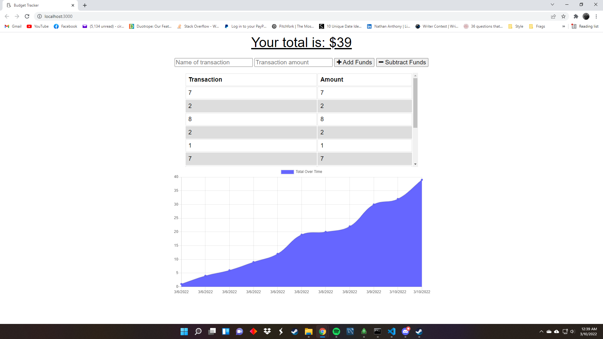

# PWA Budget Tracker

## Table of Contents
 1. [Description](#description)
 2. [Installation](#installation)
 3. [Usage](#usage)
 4. [Contributing](#contributing)
 5. [Tests](#tests)
 6. [License](#license)
 7. [Questions](#questions)

## Description
### PWA Budget Tracker is an application that allows users to enter expenses and profits which are than automatically calculated. Entries can also be made offline which the application will store and enter into the database once internet is available.
## Installation
### None necessary.
## Usage
### Simply navigate to the url here: https://frozen-cove-55681.herokuapp.com/
## Contributing
### 1. Fork the rpository on Github. 2. Clone the project to your own machine. 3. Commit changes to your branch. 4. Push your work back up to your own fork. 5. Submit a pull request so we can review your changes.
## Tests
### None.
## License
### Distributed under the GNU_GPL_v3_License
## Questions
### Email: definitelyisntme@gmail.com
### Github: [https://github.com/Pegasoos](https://github.com/Pegasoos)